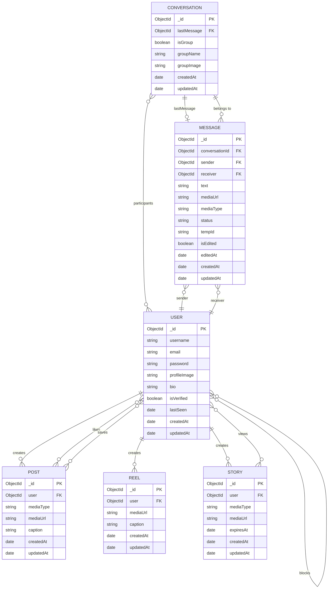
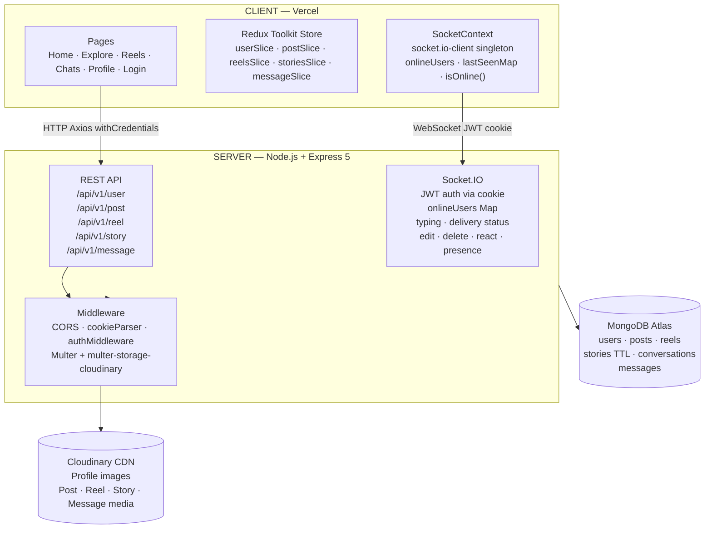
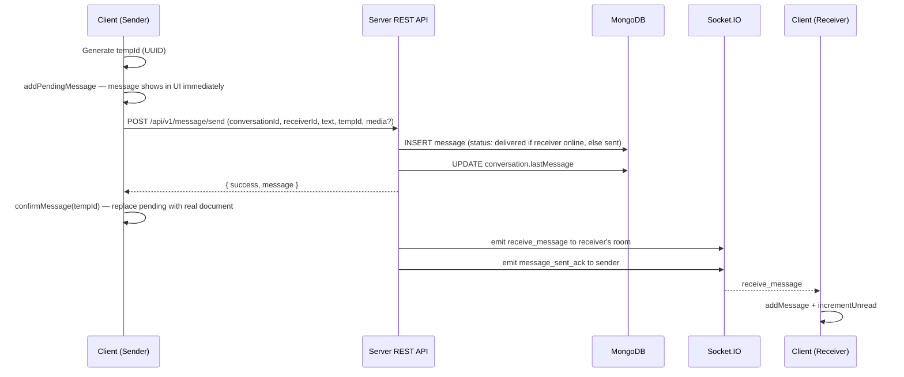
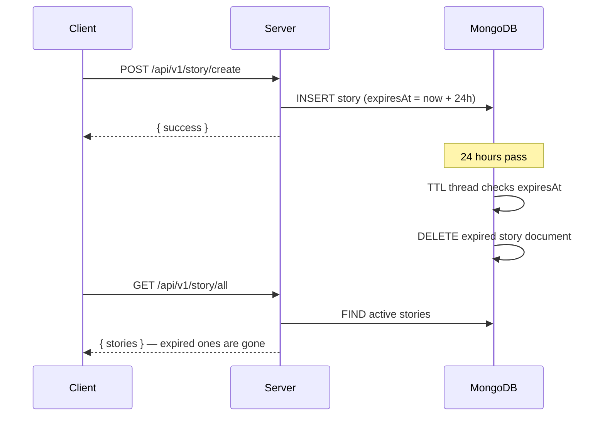
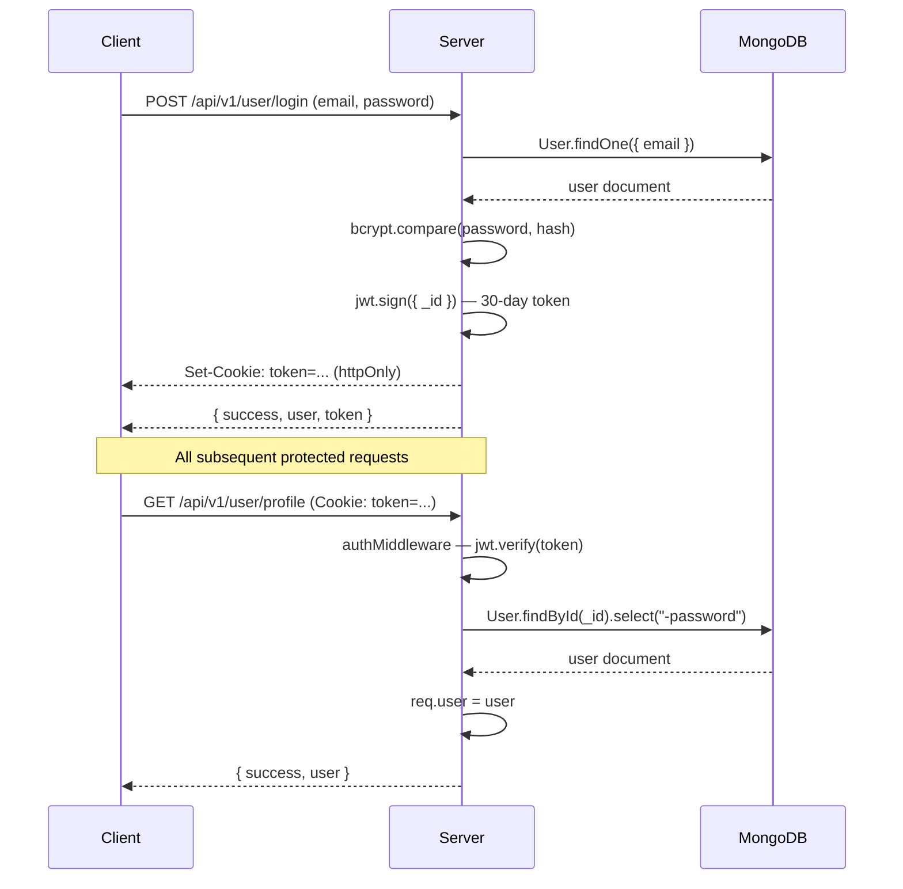

# SCHEMA.md — Database Schema & Architecture

> MongoDB collection schemas, field-level documentation, indexes, relationships, and architecture diagrams for the RUNTIME social media platform.

← [Back to root README](./README.md)

---

## Table of Contents

- [Database Overview](#database-overview)
- [Collections](#collections)
  - [User](#user-collection)
  - [Post](#post-collection)
  - [Reel](#reel-collection)
  - [Story](#story-collection)
  - [Conversation](#conversation-collection)
  - [Message](#message-collection)
- [ER Diagram](#er-diagram)
- [Relationship Map](#relationship-map)
- [Indexes](#indexes)
- [Design Decisions](#design-decisions)
- [Use Case Diagram](#use-case-diagram)
- [High-Level Architecture Diagram](#high-level-architecture-diagram)
- [Data Flow Diagrams](#data-flow-diagrams)

---

## Database Overview

| Item | Value |
|------|-------|
| Database | MongoDB via Mongoose ODM |
| Hosting | MongoDB Atlas (production) / local `mongod` (dev) |
| Collections | `users`, `posts`, `reels`, `stories`, `conversations`, `messages` |
| Mongoose version | ^9.6.3 |
| Timestamps | All schemas use `{ timestamps: true }` — auto-adds `createdAt` and `updatedAt` |

---

## Collections

---

### User Collection

**Mongoose model:** `User`

| Field | Type | Required | Constraints | Description |
|-------|------|----------|-------------|-------------|
| `_id` | ObjectId | auto | unique | MongoDB default primary key |
| `username` | String | Yes | unique, lowercase, trim | Public handle — stored lowercase |
| `email` | String | Yes | unique, lowercase, trim | Login email — stored lowercase |
| `password` | String | Yes | minlength: 6 | bcrypt hash (salt rounds: 10) — never returned in API responses |
| `profileImage` | String | No | — | Cloudinary URL for profile picture |
| `bio` | String | No | maxlength: 160 | Short user bio |
| `isVerified` | Boolean | No | default: false | Verified badge flag |
| `followers` | ObjectId[] | No | ref: User | Array of User IDs who follow this user |
| `following` | ObjectId[] | No | ref: User | Array of User IDs this user follows |
| `savedPosts` | ObjectId[] | No | ref: Post | Posts bookmarked by this user |
| `posts` | ObjectId[] | No | ref: Post | Posts created by this user |
| `reels` | ObjectId[] | No | ref: Reel | Reels created by this user |
| `story` | ObjectId[] | No | ref: Story | Active stories created by this user |
| `blocked` | ObjectId[] | No | ref: User | Users this person has blocked |
| `lastSeen` | Date | No | default: null | null = currently online; Date = last time seen online |
| `createdAt` | Date | auto | — | Document creation timestamp |
| `updatedAt` | Date | auto | — | Last modification timestamp |

```js
{
  username:     { type: String, required: true, unique: true, lowercase: true, trim: true },
  email:        { type: String, required: true, unique: true, lowercase: true, trim: true },
  password:     { type: String, required: true, minlength: 6 },
  profileImage: String,
  bio:          { type: String, maxlength: 160 },
  isVerified:   { type: Boolean, default: false },
  followers:    [{ type: ObjectId, ref: 'User' }],
  following:    [{ type: ObjectId, ref: 'User' }],
  savedPosts:   [{ type: ObjectId, ref: 'Post' }],
  posts:        [{ type: ObjectId, ref: 'Post' }],
  reels:        [{ type: ObjectId, ref: 'Reel' }],
  story:        [{ type: ObjectId, ref: 'Story' }],
  blocked:      [{ type: ObjectId, ref: 'User' }],
  lastSeen:     { type: Date, default: null },
}
```

---

### Post Collection

**Mongoose model:** `Post`

| Field | Type | Required | Constraints | Description |
|-------|------|----------|-------------|-------------|
| `_id` | ObjectId | auto | — | Primary key |
| `user` | ObjectId | Yes | ref: User | Author of the post |
| `mediaType` | String | Yes | enum: `["image", "video"]` | Type of media attached |
| `mediaUrl` | String | Yes | — | Cloudinary URL of the uploaded media |
| `caption` | String | No | — | Optional post caption |
| `likes` | ObjectId[] | No | ref: User | User IDs who liked this post |
| `comment[].user` | ObjectId | No | ref: User | Commenter's user ID |
| `comment[].text` | String | No | — | Comment body |
| `comment[].createdAt` | Date | No | — | When the comment was posted |
| `createdAt` / `updatedAt` | Date | auto | — | |

Comments are embedded inside the post document (not a separate collection). Fetching a post always returns comments in the same query.

---

### Reel Collection

**Mongoose model:** `Reel`

Same structure as Post but without `mediaType` (reels are always video).

| Field | Type | Required | Description |
|-------|------|----------|-------------|
| `_id` | ObjectId | auto | Primary key |
| `user` | ObjectId | Yes | Author — ref: User |
| `mediaUrl` | String | Yes | Cloudinary video URL |
| `caption` | String | No | Optional caption |
| `likes` | ObjectId[] | No | ref: User |
| `comment` | Array | No | Embedded comments (same shape as Post) |
| `createdAt` / `updatedAt` | Date | auto | |

---

### Story Collection

**Mongoose model:** `Story`

| Field | Type | Required | Constraints | Description |
|-------|------|----------|-------------|-------------|
| `_id` | ObjectId | auto | — | Primary key |
| `user` | ObjectId | Yes | ref: User | Author |
| `mediaType` | String | Yes | enum: `["image", "video"]` | Media type |
| `mediaUrl` | String | Yes | — | Cloudinary URL |
| `viewers` | ObjectId[] | No | ref: User | Users who have viewed this story |
| `likes` | ObjectId[] | No | ref: User | Users who liked |
| `comment` | Array | No | embedded | Embedded comments (same shape as Post) |
| `expiresAt` | Date | No | default: now + 24h | TTL expiry timestamp |
| `createdAt` / `updatedAt` | Date | auto | — | |

**TTL Index:** `storySchema.index({ expiresAt: 1 }, { expireAfterSeconds: 0 })`

MongoDB's background thread automatically removes story documents when `expiresAt` passes — no application-level cleanup needed.

---

### Conversation Collection

**Mongoose model:** `Conversation`

| Field | Type | Required | Description |
|-------|------|----------|-------------|
| `_id` | ObjectId | auto | Primary key |
| `participants` | ObjectId[] | Yes | ref: User — exactly 2 for DMs; `isGroup` flag exists for future group support |
| `lastMessage` | ObjectId | No | ref: Message — populated for conversation list previews |
| `isGroup` | Boolean | No | default: false |
| `groupName` | String | No | Only relevant if `isGroup: true` |
| `groupImage` | String | No | Group avatar URL |
| `createdAt` / `updatedAt` | Date | auto | `updatedAt` bumped on every new message |

**Compound index:** `{ participants: 1, updatedAt: -1 }` — fast lookup of a conversation between two users, sorted by recency.

---

### Message Collection

**Mongoose model:** `Message`

| Field | Type | Required | Constraints | Description |
|-------|------|----------|-------------|-------------|
| `_id` | ObjectId | auto | — | Primary key |
| `conversationId` | ObjectId | Yes | ref: Conversation, indexed | Parent conversation |
| `sender` | ObjectId | Yes | ref: User | Who sent the message |
| `receiver` | ObjectId | Yes | ref: User | Who it was sent to |
| `text` | String | No | default: `""` | Message text |
| `mediaUrl` | String | No | default: null | Cloudinary URL for media messages |
| `mediaType` | String | No | enum: `["image","video",null]` | Media type |
| `status` | String | No | enum: `["sent","delivered","read"]`, indexed | Delivery status |
| `tempId` | String | No | unique, sparse | Client UUID for idempotency on retries |
| `isEdited` | Boolean | No | default: false | True after the sender edits |
| `editedAt` | Date | No | default: null | Timestamp of last edit |
| `deletedFor` | ObjectId[] | No | ref: User | Users for whom the message is hidden. Both sender + receiver = deleted for everyone |
| `reactions[].user` | ObjectId | No | ref: User | Reactor |
| `reactions[].emoji` | String | No | — | Emoji character |
| `createdAt` / `updatedAt` | Date | auto | — | |

**Compound index:** `{ conversationId: 1, createdAt: -1 }` — cursor-based pagination (newest-first loading, older pages prepended on scroll-up).

---

## ER Diagram



---

## Relationship Map

| From | Field | Relation | To | Notes |
|------|-------|----------|----|-------|
| User | `followers` | Many-to-many via array | User | Bidirectional with `following` |
| User | `following` | Many-to-many via array | User | See above |
| User | `posts` | One-to-many | Post | User holds ref array; Post also holds `user` ref |
| User | `reels` | One-to-many | Reel | Same dual-reference pattern |
| User | `story` | One-to-many | Story | Same pattern |
| User | `savedPosts` | Many-to-many via array | Post | Bookmarked posts |
| User | `blocked` | One-directional via array | User | Blocks are not symmetric |
| Post | `likes` | Many-to-many via array | User | Array of liker IDs |
| Post | `comment[].user` | Embedded many-to-one | User | Comments embedded, not a separate collection |
| Reel | `likes`, `comment[].user` | Same as Post | User | Identical pattern |
| Story | `likes`, `viewers`, `comment[].user` | Same as Post | User | Plus `viewers` array for view tracking |
| Conversation | `participants` | Many-to-many | User | 2 for DMs |
| Conversation | `lastMessage` | One-to-one pointer | Message | Pointer to most recent message |
| Message | `conversationId` | Many-to-one | Conversation | All messages belong to a conversation |
| Message | `sender`, `receiver` | Many-to-one | User | Denormalized for fast queries |
| Message | `deletedFor` | Soft-delete array | User | IDs of users for whom the message is hidden |
| Message | `reactions[].user` | Embedded many-to-one | User | One reaction per user |

---

## Indexes

| Collection | Index | Type | Purpose |
|------------|-------|------|---------|
| `users` | `{ username: 1 }` | Unique | Unique username enforcement and lookup |
| `users` | `{ email: 1 }` | Unique | Unique email enforcement and login lookup |
| `stories` | `{ expiresAt: 1 }` | TTL (`expireAfterSeconds: 0`) | Auto-delete stories after 24 hours |
| `conversations` | `{ participants: 1, updatedAt: -1 }` | Compound | Fast conversation lookup between two users, sorted by recency |
| `messages` | `{ conversationId: 1 }` | Single-field | Filter messages by conversation |
| `messages` | `{ status: 1 }` | Single-field | Find undelivered / unread messages |
| `messages` | `{ conversationId: 1, createdAt: -1 }` | Compound | Cursor-based pagination, newest-first |
| `messages` | `{ tempId: 1 }` | Unique, sparse | Idempotency — prevent duplicate messages on client retry |

---

## Design Decisions

### 1. Embedded Comments
Comments on posts, reels, and stories are stored as embedded sub-documents rather than in a separate collection. One query returns a post with all its comments.

### 2. Dual-Reference on Posts / Reels / Stories
Both the `User` document (`user.posts[]`) and the `Post` document (`post.user`) reference each other. This lets you fetch a user's posts from their `posts` array without a separate query, and populate the author on a post with a single `.populate("user")`. Trade-off: both documents must be updated on creation/deletion.

### 3. Message `deletedFor` Soft Delete
Messages are never physically removed. The `deletedFor` array holds user IDs. If both sender and receiver are present, the message is treated as "deleted for everyone" and shown as a placeholder. If only the requester's ID is present, only they see it as deleted.

### 4. Message `tempId` for Optimistic UI
The client generates a UUID before sending. The message is immediately shown in the UI. Once the server responds, the pending entry is replaced by the real document. The `tempId` field (unique + sparse index) prevents duplicate messages if the client retries.

### 5. `lastSeen: null` Means Online
A `null` value for `lastSeen` means the user is currently connected. On socket disconnect (with no remaining sockets for that user), the server writes the current `Date` to `lastSeen` and broadcasts `user_last_seen` to all clients.

### 6. Story TTL via MongoDB Native Feature
Story expiration is handled by MongoDB's built-in TTL index on `expiresAt`. MongoDB's background thread removes expired documents automatically — no cron job or application code needed.

### 7. Conversation-Scoped Socket Rooms
When a user opens a conversation, the client emits `join_conversation` and the server joins the socket to the room `conv_<conversationId>`. Message events (new message, edit, delete, reaction, typing) are scoped to this room so they are only received by sockets that have the conversation open.

---

## Use Case Diagram

```mermaid
flowchart TD
    Visitor([Visitor])
    AuthUser([Authenticated User])

    Visitor --> Register
    Visitor --> Login
    Login --> AuthUser

    AuthUser --> Feed[View Home Feed]
    AuthUser --> Stories[View Stories]
    Stories --> ViewStory[Story view recorded in viewers array]
    AuthUser --> Reels[View Reels]
    AuthUser --> Explore[Explore - all posts grid]

    AuthUser --> CreatePost[Create Post - image or video]
    AuthUser --> CreateReel[Create Reel - video]
    AuthUser --> CreateStory[Create Story - expires in 24h]

    AuthUser --> Like[Like / Unlike Post, Reel, Story]
    AuthUser --> Comment[Comment on Post, Reel, Story]
    AuthUser --> Bookmark[Bookmark / Unbookmark Post]
    AuthUser --> DeleteContent[Delete own Post, Reel, Story]

    AuthUser --> Profile[View User Profile]
    Profile --> PostGrid[See post grid]
    Profile --> FollowCounts[See follower and following counts]
    Profile --> OpenDM[Open DM conversation]

    AuthUser --> Follow[Follow / Unfollow User]
    Follow --> Notify[Target receives real-time notification]

    AuthUser --> EditProfile[Edit Own Profile]
    EditProfile --> EditUsername[Change username or bio]
    EditProfile --> UploadPhoto[Upload profile photo]

    AuthUser --> Suggestions[View Suggested Users]

    AuthUser --> DM[Direct Messages]
    DM --> SendText[Send text message]
    DM --> SendMedia[Send image or video]
    DM --> EditMsg[Edit sent message]
    DM --> DeleteMsg[Delete message - for me or everyone]
    DM --> React[React to message with emoji]
    DM --> DeliveryStatus[See delivery status - sent, delivered, read]
    DM --> Typing[See typing indicator]
    DM --> Presence[See online and last-seen status]

    AuthUser --> Block[Block / Unblock User]
    AuthUser --> Logout
```



---

## High-Level Architecture Diagram



---

## Data Flow Diagrams

### Send Message Flow



---

### Story Expiry Flow



---

### Authentication Flow


